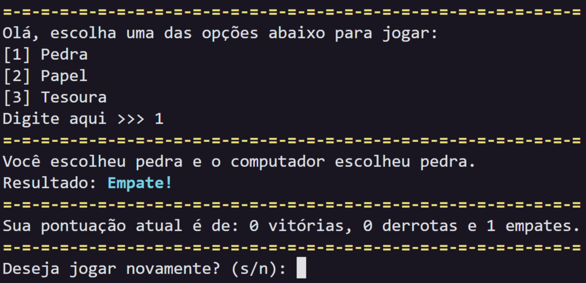

# Pedra, Papel e Tesoura (Jokempo)
Este é um jogo simples desenvolvido em **PYTHON**para jogar Pedra, Papel e Tesoura contra a máquina.

---

### 🕹 Como Jogar:
> No momento, não é possível jogar o jogo online. (Por enquanto...)

- ### Primeiro método: Clonando o repositório

1. Clone este repositório Git:
    ```bash
    git clone https://github.com/JoaoMarceloGuastala/pedraPapelTesouraPython.git
    ```
2. Abra o arquivo `main.py` em seu editor de código.

- ### Segundo método: Baixando o arquivo ZIP

1. Baixe o arquivo `ZIP` deste repositório.
2. Clique em `<> Code`, se o seu estiver em português: `<> Código`.
3. Depois clique em `Download ZIP`, se o seu estiver em português: `Baixar ZIP`.
4. Abra seu gerenciador de arquivos e extraia a pasta, clicando nela com o botão **direito** e depois em **Extrair aqui**.
5. Execute o arquivo `main.py` e se divirta.

---

### 🔬 O que foi utilizado:    
- **PYTHON**: Todo o código é feito em Python.
- **BIBLIOTECAS UTILIZADAS**: Todas fazem parte da biblioteca padrão do Python, então não precisa instalar nada extra:
    - `random`: para a máquina fazer a jogada aleatoriamente.
    - `time`: para dar aqueles delays bonitinhos e criar uma experiência mais fluida.
    - `os`: para limpar o terminal dependendo do sistema operacional (Windows/Linux/macOS).

---

### ⌨ Sobre o desenvolvimento: 
Não foi algo complicado ou de "quebrar a cabeça" mais em certas partes acabei esquecendo algumas coisas(coisas até que bem básicas, como: while e dicionários), mas tirando isso foi um código divertido e interessante de fazer. 

---

### ℹ Observações:    
Esse jogo foi feito para melhorar minhas habilidades em desenvolvimento python, então não espere muito.

---

### Imagem do jogo:
Aqui está a tela final do jogo Pedra, Papel e Tesoura: 

---

### Licença:
Este projeto está licenciado sob a [MIT License](https://opensource.org/licenses/MIT).

---

Obrigado e até mais, terráqueos! 🖖🏻

---
Acesse o repositório do projeto [aqui](https://github.com/JoaoMarceloGuastala/pedraPapelTesouraPython.git)
